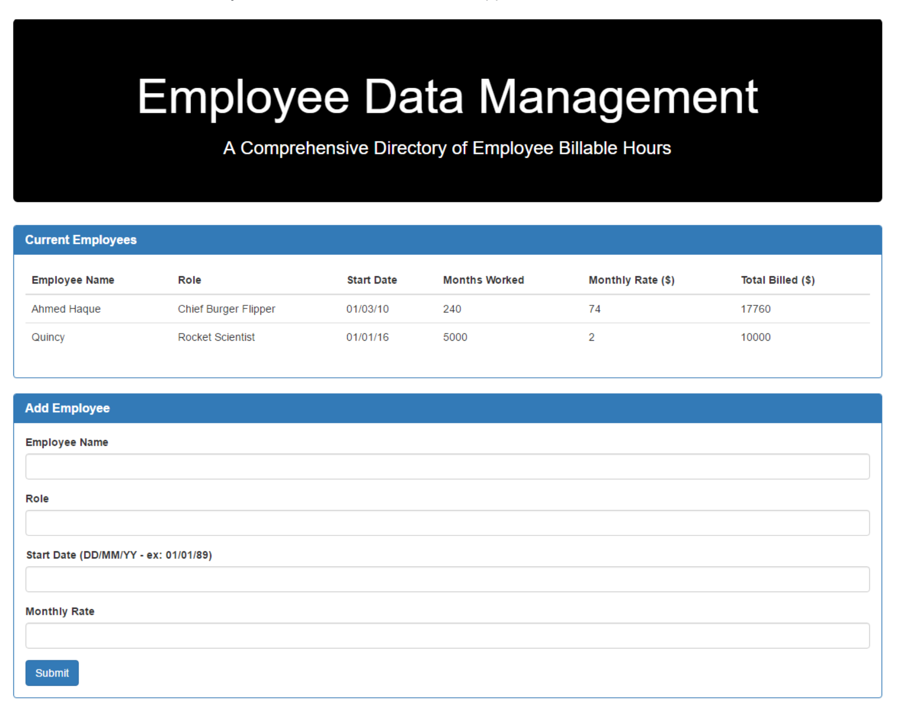

# EmployeeDataManagement

### Instructions:

1. Focus all your efforts on creating the application layout for your site.

2. This phase involves both:

  * Creating the initial .on("click") event that will dynamically trigger new HTML rows to be generated.

  * This phase DOES NOT involve sending or receiving data to Firebase.

3. If you finish early:

  * Continue refining the design! Take things to the next level. Make this application portfolio-grade!

  * Begin reading about push({}) and .on("child_added") in the Firebase documentation.

